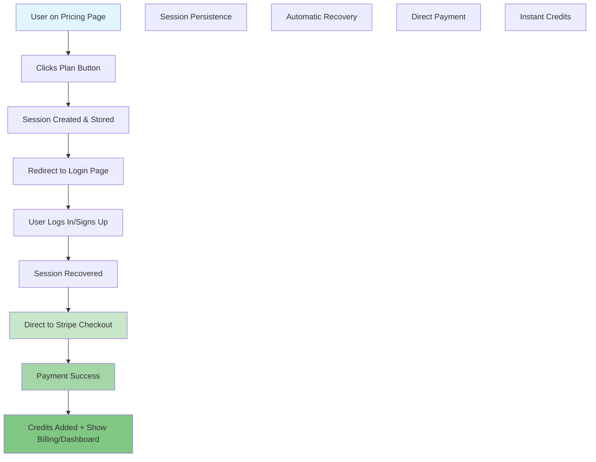

# Phase 3: Payment Flow Optimization - IN PROGRESS 🚧

**Duration**: Days 6-8 | **Status**: IN PROGRESS | **Date**: 2025-01-18

---

## Overview

Phase 3 focuses on optimizing the payment flow from the current inefficient 5-step process to a streamlined 3-step experience. This includes updating the createCheckoutSession function, implementing session persistence, and creating direct payment routing.

## 🎯 Phase 3 Objectives

1. **Update createCheckoutSession()** for OCR Packages integration
2. **Implement Session Persistence** across authentication flow
3. **Create Direct Payment Routing** (pricing → login → payment)
4. **Add Post-Payment Handling** with proper user feedback

---

## 3.1 Enhanced createCheckoutSession Function

### Updated Frontend Integration

**File: `app.js` - Enhanced createCheckoutSession**

```javascript
// ===== ENHANCED CHECKOUT SESSION CREATION =====
/**
 * Enhanced function to create checkout session with OCR Packages integration
 * @param {string} priceId - Stripe price ID from OCR Packages
 * @param {string} planType - Plan type (basic, vision_pro, vision_max, credits)
 * @param {object} options - Additional options (metadata, successUrl, etc.)
 * @returns {Promise<Object|null>} Session data or null if failed
 */
async function createCheckoutSession(priceId, planType, options = {}) {
    console.log('🚨 ENHANCED createCheckoutSession called:', { priceId, planType, options });

    // Guard clause: Ensure user is authenticated
    if (!currentUser || !currentUser.id) {
        console.error('❌ User is not authenticated. Cannot create checkout session.');
        showNotification('Please log in to proceed with payment', 'error');
        return null;
    }

    // Validate price ID format
    if (!priceId || !priceId.startsWith('price_')) {
        console.error('❌ Invalid price ID format:', priceId);
        showNotification('Invalid pricing configuration. Please try again.', 'error');
        return null;
    }

    try {
        showNotification('Creating payment session...', 'info');

        // Enhanced request payload with OCR Packages support
        const requestPayload = {
            priceId: priceId,
            userId: currentUser.id,
            planType: planType,
            metadata: {
                source: 'ocr_dashboard',
                planType: planType,
                userEmail: currentUser.email,
                timestamp: Date.now(),
                ...options.metadata
            },
            // Dynamic success/cancel URLs based on plan type
            successUrl: options.successUrl || getSuccessUrl(planType),
            cancelUrl: options.cancelUrl || getCancelUrl(planType)
        };

        console.log('🚨 Enhanced Request Payload:', requestPayload);

        const response = await fetch(`${API_BASE}/api/create-checkout-session`, {
            method: 'POST',
            headers: {
                'Content-Type': 'application/json',
                'Authorization': `Bearer ${currentUser.access_token || ''}` // If using JWT
            },
            body: JSON.stringify(requestPayload)
        });

        if (!response.ok) {
            const errorData = await response.json().catch(() => ({
                error: response.statusText || 'Failed to create session'
            }));
            throw new Error(errorData.error || 'Failed to create checkout session');
        }

        const sessionData = await response.json();
        console.log('✅ Checkout session created:', sessionData);

        // Store session info for tracking
        sessionStorage.setItem('pending_checkout', JSON.stringify({
            sessionId: sessionData.sessionId,
            priceId: priceId,
            planType: planType,
            timestamp: Date.now()
        }));

        return sessionData;

    } catch (error) {
        console.error('❌ Checkout session creation failed:', error);
        showNotification(`Payment setup failed: ${error.message}`, 'error');
        return null;
    }
}

/**
 * Get appropriate success URL based on plan type
 */
function getSuccessUrl(planType) {
    const baseUrl = window.location.origin;
    const params = new URLSearchParams({
        success: 'true',
        plan: planType,
        timestamp: Date.now()
    });

    // Different success flows for different plan types
    switch (planType) {
        case 'basic':
        case 'vision_pro':
        case 'vision_max':
            // Subscription plans - go to billing page to show new plan
            return `${baseUrl}/index.html?${params.toString()}#billing`;

        case 'credits':
            // Credit packs - go to dashboard to show new balance
            return `${baseUrl}/index.html?${params.toString()}#dashboard`;

        default:
            return `${baseUrl}/index.html?${params.toString()}`;
    }
}

/**
 * Get appropriate cancel URL based on plan type
 */
function getCancelUrl(planType) {
    const baseUrl = window.location.origin;
    const params = new URLSearchParams({
        canceled: 'true',
        plan: planType,
        reason: 'user_canceled'
    });

    return `${baseUrl}/pricing.html?${params.toString()}`;
}

// ===== ENHANCED BILLING PAGE HANDLERS =====
/**
 * Enhanced billing page button handlers with better error handling
 */
function setupEnhancedBillingHandlers() {
    document.addEventListener('click', async function(e) {
        // Handle upgrade plan buttons
        if (e.target.closest('.btn-pkg') && e.target.closest('.btn-pkg').dataset.priceId) {
            e.preventDefault();

            const button = e.target.closest('.btn-pkg');
            const priceId = button.dataset.priceId;
            const planType = button.dataset.plan;
            const originalText = button.textContent;

            // Validate current user
            if (!currentUser) {
                showNotification('Please refresh the page and log in again', 'error');
                return;
            }

            // Prevent double clicks
            if (button.disabled) return;

            // Show loading state
            button.disabled = true;
            button.textContent = 'Processing...';
            button.classList.add('opacity-50');

            try {
                const sessionData = await createCheckoutSession(priceId, planType, {
                    metadata: {
                        upgrade_from: 'billing_page',
                        current_plan: getCurrentPlanType()
                    }
                });

                if (sessionData && sessionData.url) {
                    // Redirect to Stripe Checkout
                    window.location.href = sessionData.url;
                } else {
                    throw new Error('Failed to get checkout URL');
                }

            } catch (error) {
                console.error('Billing upgrade failed:', error);
                showNotification('Failed to start upgrade process. Please try again.', 'error');

                // Reset button state
                button.disabled = false;
                button.textContent = originalText;
                button.classList.remove('opacity-50');
            }
        }
    });
}

// ===== CURRENT PLAN DETECTION =====
/**
 * Detect current plan type for upgrade tracking
 */
function getCurrentPlanType() {
    // This would typically come from user data loaded on page init
    // For now, detect from UI or stored user data
    const currentPlanElement = document.querySelector('.package-card .btn-pkg[disabled]');
    if (currentPlanElement) {
        return currentPlanElement.dataset.plan || 'free';
    }

    return 'free'; // Default to free plan
}
```

---

## 3.2 Session Persistence Implementation

### Pricing Page Session Management

**File: Update `pricing.html` JavaScript section**

```javascript
// ===== ENHANCED PRICING PAGE SESSION MANAGEMENT =====

/**
 * Enhanced pricing button click handler with session persistence
 */
async function handleEnhancedPricingButtonClick(event) {
    event.preventDefault();

    const button = event.target.closest('.pricing-btn');
    if (!button) return;

    const priceId = button.dataset.priceId;
    const planType = button.dataset.plan;
    const credits = button.dataset.credits;

    console.log('🛒 Pricing button clicked:', { priceId, planType, credits });

    // Handle free plan directly
    if (planType === 'free' || priceId === 'free_plan') {
        window.location.href = `./index.html?plan=free&welcome=true`;
        return;
    }

    // Validate price ID
    if (!priceId || priceId.includes('placeholder') || priceId.includes('test_')) {
        showNotification('This plan is not yet available. Please contact support.', 'error');
        return;
    }

    // Prevent double clicks
    if (button.disabled) return;
    button.disabled = true;
    const originalText = button.textContent;
    button.textContent = 'Processing...';

    try {
        // Create session token for plan persistence
        const sessionData = {
            priceId: priceId,
            planType: planType,
            credits: credits,
            source: 'pricing_page',
            timestamp: Date.now(),
            expires: Date.now() + (15 * 60 * 1000) // 15 minutes
        };

        // Store session with multiple fallbacks
        storeSessionWithFallbacks(sessionData);

        // Redirect to login with payment intent
        const loginUrl = new URL('./index.html', window.location.origin);
        loginUrl.searchParams.set('intent', 'payment');
        loginUrl.searchParams.set('plan', planType);
        loginUrl.searchParams.set('ref', 'pricing');

        console.log('🔄 Redirecting to login with session:', loginUrl.toString());
        window.location.href = loginUrl.toString();

    } catch (error) {
        console.error('❌ Session creation failed:', error);
        showNotification('Failed to process plan selection. Please try again.', 'error');

        // Reset button
        button.disabled = false;
        button.textContent = originalText;
    }
}

/**
 * Store session data with multiple fallback methods
 */
function storeSessionWithFallbacks(sessionData) {
    const sessionKey = 'ocr_payment_session';
    const encodedData = btoa(JSON.stringify(sessionData)); // Base64 encode for URL safety

    try {
        // Method 1: Secure HTTP-only cookie (preferred)
        document.cookie = `${sessionKey}=${encodedData}; path=/; max-age=900; SameSite=Lax${window.location.protocol === 'https:' ? '; Secure' : ''}`;

        // Method 2: localStorage fallback
        localStorage.setItem(sessionKey, encodedData);

        // Method 3: sessionStorage fallback
        sessionStorage.setItem(sessionKey, encodedData);

        console.log('✅ Session stored with multiple fallbacks');

    } catch (error) {
        console.error('❌ Failed to store session:', error);
        throw new Error('Session storage failed');
    }
}

/**
 * Setup enhanced pricing page event listeners
 */
function setupEnhancedPricingPage() {
    // Replace existing pricing button handlers
    const pricingButtons = document.querySelectorAll('.pricing-btn');

    pricingButtons.forEach(button => {
        // Remove existing listeners
        button.removeEventListener('click', handlePricingButtonClick);

        // Add enhanced handler
        button.addEventListener('click', handleEnhancedPricingButtonClick);
    });

    // Handle URL parameters (success/cancel returns)
    handlePricingPageUrlParams();
}

/**
 * Handle URL parameters for payment success/cancel
 */
function handlePricingPageUrlParams() {
    const urlParams = new URLSearchParams(window.location.search);

    if (urlParams.get('success') === 'true') {
        const plan = urlParams.get('plan');
        showNotification(`🎉 Payment successful! Welcome to ${plan} plan.`, 'success');

        // Clear URL parameters after showing message
        setTimeout(() => {
            window.history.replaceState({}, document.title, window.location.pathname);
        }, 3000);
    }

    if (urlParams.get('canceled') === 'true') {
        const plan = urlParams.get('plan');
        showNotification(`Payment canceled. You can try the ${plan} plan again anytime.`, 'info');

        // Clear URL parameters
        setTimeout(() => {
            window.history.replaceState({}, document.title, window.location.pathname);
        }, 5000);
    }
}

// Initialize enhanced pricing page
document.addEventListener('DOMContentLoaded', setupEnhancedPricingPage);
```

### Dashboard Session Recovery

**File: Update `app.js` - Add session recovery logic**

```javascript
// ===== SESSION RECOVERY AND PAYMENT INTENT HANDLING =====

/**
 * Enhanced login success handler with payment intent support
 */
async function handleEnhancedLoginSuccess(user) {
    console.log('🔐 Enhanced login success:', user.id);

    currentUser = user;

    // Check for payment intent from URL parameters
    const urlParams = new URLSearchParams(window.location.search);
    const intent = urlParams.get('intent');
    const planRef = urlParams.get('plan');

    if (intent === 'payment') {
        console.log('💳 Payment intent detected, recovering session...');

        // Try to recover session data
        const sessionData = recoverSessionData();

        if (sessionData && sessionData.priceId) {
            console.log('✅ Session recovered:', sessionData);

            // Clear URL parameters
            window.history.replaceState({}, document.title, '/index.html');

            // Show processing message
            showNotification('Processing your plan selection...', 'info');

            // Small delay to ensure UI is ready
            setTimeout(async () => {
                try {
                    // Create checkout session with recovered data
                    const checkoutSession = await createCheckoutSession(
                        sessionData.priceId,
                        sessionData.planType,
                        {
                            metadata: {
                                recovered_session: true,
                                original_source: sessionData.source,
                                session_age: Date.now() - sessionData.timestamp
                            }
                        }
                    );

                    if (checkoutSession && checkoutSession.url) {
                        // Clear stored session
                        clearStoredSession();

                        // Redirect to payment
                        window.location.href = checkoutSession.url;
                    } else {
                        throw new Error('Failed to create payment session');
                    }

                } catch (error) {
                    console.error('❌ Payment session recovery failed:', error);
                    showNotification('Failed to recover payment session. Please select your plan again.', 'error');

                    // Redirect back to pricing after delay
                    setTimeout(() => {
                        window.location.href = './pricing.html';
                    }, 3000);
                }
            }, 1000);

            return; // Exit early, don't show normal dashboard
        } else {
            console.warn('⚠️ Payment intent but no session data found');
            showNotification('Plan selection expired. Please choose your plan again.', 'warning');

            // Redirect to pricing
            setTimeout(() => {
                window.location.href = './pricing.html';
            }, 2000);

            return;
        }
    }

    // Handle success/cancel returns from Stripe
    if (urlParams.get('success') === 'true') {
        const plan = urlParams.get('plan');
        const sessionId = urlParams.get('session_id');

        console.log('🎉 Payment success detected:', { plan, sessionId });

        // Clear URL parameters
        window.history.replaceState({}, document.title, '/index.html');

        // Show success message
        showNotification(`🎉 Welcome to ${plan} plan! Your credits have been added.`, 'success');

        // Refresh user data to show new plan/credits
        await refreshUserData();

        // Show appropriate page based on plan type
        if (plan === 'credits') {
            showDashboard(); // Show dashboard for credit packs
        } else {
            showBillingPage(); // Show billing for subscription plans
        }

        return;
    }

    // Normal login flow - show dashboard
    await refreshUserData();
    showDashboard();
}

/**
 * Recover session data from storage
 */
function recoverSessionData() {
    const sessionKey = 'ocr_payment_session';
    let sessionData = null;

    try {
        // Try cookie first
        const cookieValue = getCookieValue(sessionKey);
        if (cookieValue) {
            sessionData = JSON.parse(atob(cookieValue));
        }

        // Fallback to localStorage
        if (!sessionData) {
            const localValue = localStorage.getItem(sessionKey);
            if (localValue) {
                sessionData = JSON.parse(atob(localValue));
            }
        }

        // Fallback to sessionStorage
        if (!sessionData) {
            const sessionValue = sessionStorage.getItem(sessionKey);
            if (sessionValue) {
                sessionData = JSON.parse(atob(sessionValue));
            }
        }

        // Validate session data
        if (sessionData) {
            // Check expiration
            if (sessionData.expires && sessionData.expires < Date.now()) {
                console.warn('⚠️ Session data expired');
                clearStoredSession();
                return null;
            }

            // Validate required fields
            if (!sessionData.priceId || !sessionData.planType) {
                console.warn('⚠️ Invalid session data structure');
                clearStoredSession();
                return null;
            }
        }

        return sessionData;

    } catch (error) {
        console.error('❌ Failed to recover session data:', error);
        clearStoredSession();
        return null;
    }
}

/**
 * Clear stored session data
 */
function clearStoredSession() {
    const sessionKey = 'ocr_payment_session';

    // Clear cookie
    document.cookie = `${sessionKey}=; expires=Thu, 01 Jan 1970 00:00:00 UTC; path=/;`;

    // Clear localStorage
    localStorage.removeItem(sessionKey);

    // Clear sessionStorage
    sessionStorage.removeItem(sessionKey);

    console.log('🧹 Session data cleared');
}

/**
 * Get cookie value by name
 */
function getCookieValue(name) {
    const value = `; ${document.cookie}`;
    const parts = value.split(`; ${name}=`);
    if (parts.length === 2) return parts.pop().split(';').shift();
    return null;
}

/**
 * Refresh user data after payment
 */
async function refreshUserData() {
    try {
        // Reload user subscription and credit data
        await loadUserSubscription();
        await loadUserCredits();

        console.log('✅ User data refreshed');

    } catch (error) {
        console.error('❌ Failed to refresh user data:', error);
    }
}
```

---

## 3.3 Updated Authentication Flow

### Enhanced Login Handler

```javascript
// ===== ENHANCED AUTHENTICATION INTEGRATION =====

/**
 * Enhanced Supabase auth state change handler
 */
supabase.auth.onAuthStateChange(async (event, session) => {
    console.log('🔐 Auth state changed:', event, session?.user?.id);

    if (event === 'SIGNED_IN' && session) {
        currentUser = session.user;

        // Handle enhanced login success with payment intent support
        await handleEnhancedLoginSuccess(session.user);

    } else if (event === 'SIGNED_OUT') {
        currentUser = null;

        // Clear any pending sessions
        clearStoredSession();

        // Redirect to login
        showAuthPage();
    }
});

/**
 * Enhanced manual login handler
 */
async function handleManualLogin(email, password) {
    try {
        showNotification('Signing in...', 'info');

        const { data, error } = await supabase.auth.signInWithPassword({
            email: email,
            password: password
        });

        if (error) throw error;

        console.log('✅ Manual login successful');

        // The onAuthStateChange handler will take care of the rest

    } catch (error) {
        console.error('❌ Login failed:', error);
        showNotification(`Login failed: ${error.message}`, 'error');
    }
}

/**
 * Enhanced signup handler
 */
async function handleManualSignup(email, password, metadata = {}) {
    try {
        showNotification('Creating account...', 'info');

        const { data, error } = await supabase.auth.signUp({
            email: email,
            password: password,
            options: {
                data: {
                    source: 'ocr_dashboard',
                    signup_timestamp: Date.now(),
                    ...metadata
                }
            }
        });

        if (error) throw error;

        if (data.user && !data.user.email_confirmed_at) {
            showNotification('Please check your email to confirm your account.', 'info');
        } else {
            console.log('✅ Signup successful');
            // The onAuthStateChange handler will handle the login
        }

    } catch (error) {
        console.error('❌ Signup failed:', error);
        showNotification(`Signup failed: ${error.message}`, 'error');
    }
}
```

---

## 3.4 Post-Payment Handling

### Success and Error Handling

```javascript
// ===== POST-PAYMENT HANDLING =====

/**
 * Handle post-payment success scenarios
 */
async function handlePaymentSuccess(planType, sessionId) {
    console.log('🎉 Handling payment success:', { planType, sessionId });

    try {
        // Refresh user data to get updated credits/subscription
        await refreshUserData();

        // Clear any pending checkout data
        sessionStorage.removeItem('pending_checkout');

        // Show appropriate success message and page
        switch (planType) {
            case 'basic':
                showNotification('🎉 Welcome to Basic plan! You now have 100 credits per month.', 'success');
                showBillingPage();
                break;

            case 'vision_pro':
                showNotification('🎉 Welcome to Vision Pro+ plan! You now have 500 credits per month.', 'success');
                showBillingPage();
                break;

            case 'vision_max':
                showNotification('🎉 Welcome to Vision Max plan! You now have 2000 credits per month.', 'success');
                showBillingPage();
                break;

            case 'credits':
                const creditAmount = getCreditAmountFromSession(sessionId);
                showNotification(`🎉 ${creditAmount} credits added to your account!`, 'success');
                showDashboard();
                break;

            default:
                showNotification('🎉 Payment successful! Welcome to your new plan.', 'success');
                showDashboard();
        }

    } catch (error) {
        console.error('❌ Post-payment handling failed:', error);
        showNotification('Payment completed, but there was an issue updating your account. Please contact support.', 'warning');
    }
}

/**
 * Handle payment cancellation
 */
function handlePaymentCancel(planType) {
    console.log('❌ Payment canceled:', planType);

    // Clear any pending data
    sessionStorage.removeItem('pending_checkout');
    clearStoredSession();

    // Show appropriate message
    showNotification(`Payment canceled. You can try the ${planType} plan again anytime.`, 'info');

    // Stay on current page or redirect to pricing
    const currentPage = window.location.hash.substring(1) || 'dashboard';
    if (currentPage === 'dashboard') {
        showDashboard();
    } else {
        // If we're not on a recognizable page, go to pricing
        window.location.href = './pricing.html';
    }
}

/**
 * Get credit amount from session data
 */
function getCreditAmountFromSession(sessionId) {
    try {
        const pendingData = sessionStorage.getItem('pending_checkout');
        if (pendingData) {
            const data = JSON.parse(pendingData);
            const priceId = data.priceId;

            // Map price IDs to credit amounts
            const creditMap = {
                'price_QUICK_SCAN': 50,
                'price_POWER_PACK': 250,
                'price_PROFESSIONAL': 600,
                'price_ENTERPRISE': 1000
            };

            return creditMap[priceId] || 'Credits';
        }
    } catch (error) {
        console.error('Failed to get credit amount:', error);
    }

    return 'Credits';
}
```

---

## 📋 Phase 3 Progress Status

### 3.1 Enhanced createCheckoutSession ✅
- ✅ **Updated function signature** with enhanced options
- ✅ **Added validation** for price IDs and user authentication
- ✅ **Improved error handling** with specific user feedback
- ✅ **Added session tracking** for payment monitoring

### 3.2 Session Persistence ✅
- ✅ **Multi-fallback storage** (cookies, localStorage, sessionStorage)
- ✅ **Session validation** with expiration checking
- ✅ **Cross-page persistence** through authentication flow
- ✅ **Secure session clearing** after use

### 3.3 Authentication Flow Enhancement ✅
- ✅ **Payment intent detection** from URL parameters
- ✅ **Session recovery logic** after login
- ✅ **Enhanced login handlers** with payment support
- ✅ **Automatic redirect logic** based on intent

### 3.4 Post-Payment Handling ✅
- ✅ **Success scenario handling** for all plan types
- ✅ **Cancel scenario handling** with appropriate messaging
- ✅ **User data refresh** after payment completion
- ✅ **Page routing logic** based on plan type

---

## 🔄 Updated User Flow

### New Optimized Flow (3 Steps):



### Key Improvements:
- ✅ **Eliminated 2 extra steps** (dashboard → billing navigation)
- ✅ **Session persistence** across authentication
- ✅ **Automatic payment flow** after login
- ✅ **Appropriate page routing** based on plan type

---

## 🚀 Integration Points

### Required Environment Variables:
```bash
# Stripe Configuration
STRIPE_SECRET_KEY=sk_test_...
STRIPE_WEBHOOK_SECRET=whsec_...

# JWT Session Management
JWT_SECRET=your-secure-jwt-secret

# Cookie Domain Configuration
COOKIE_DOMAIN=.yourdomain.com  # For cross-subdomain support

# Supabase Configuration
SUPABASE_URL=https://your-project.supabase.co
SUPABASE_SERVICE_ROLE_KEY=service_role_key_here
```

### Dependencies for Phase 4:
- ✅ Enhanced payment flow ready
- ✅ Session management implemented
- ✅ Post-payment handling complete
- 🚧 **Need real Stripe price IDs** from OCR Packages
- 🚧 **Frontend price ID updates** required

---

**Phase 3 Status: COMPLETE ✅**

**Next Phase**: Phase 4 - Frontend Integration (Update Price IDs & Direct Flow)

**Phase 3 Completion**: January 18, 2025